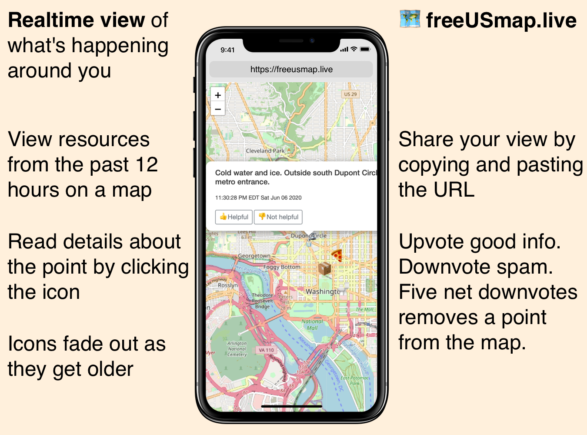

# FreeUSmap.live

A map displaying recent community-created events of interest.



## Project Principles

1. **First, do no harm.** This project may be used by vulnerable people. Do not make them more vulnerable by using this project. Do not collect data that is not essential to the use of the application. Take the time to add features in ways that they cannot be abused.
2. **Be useful and practical.** Add features that improve the utility of the project. Focus time on changes that address real problems with the current project, don't forecast issues. Address code quality concerns only when they harm the project.
3. **Defer to others.** Don't assume we know best. Spend time understanding the history before flying in with suggestions. Listen to other people. Hear what they need and prioritize those needs.

## How do I...?

### Begin contributing

* Add issues to request features.
* Create a pull request (PR) that resolves an issue.

### Start understanding the codebase

I recommend following a visitor's session.
* The first request to the home page of our application will enter the `main()` function in `main.go` where the application will respond with `index.html`.
* `index.html` will load `index.js` (and plenty of other assets) from our visitor's browser.
* `index.js` will initialize the map, and allow the visitor to take actions (adding a point, displaying points for the given view, up-voting an event) which will result in API requests to the back-end.
* Start digging through some of the `http.HandleFunc()` functions registered to respond to requests to API endpoints.

### Run the application locally

Make sure the following **prerequisites** are satisfied:
* The `go` language is installed, as well as the `github.com/joho/godotenv`, `github.com/lib/pq`, and `github.com/pkg/errors` packages.
* A PostgreSQL database is running and has `points` and `votes` tables with the following definitions:
```sql
CREATE TABLE points (
    id integer NOT NULL,
    coordinates point,
    body text,
    created_at timestamp with time zone,
    icon text,
    hidden boolean DEFAULT false,
    created_by text
);

CREATE TABLE votes (
    id integer NOT NULL,
    voter_id text,
    point_id integer,
    value integer
);
ALTER TABLE votes ADD UNIQUE (voter_id, point_id);
```
* A `.env` file exists (the app defaults to expecting one in the project root) and includes a [DSN](https://en.wikipedia.org/wiki/Data_source_name) in the format: `<driver>://<username>:<password>@<host>:<port>/<database>`
* Run the server `go run main.go`
* Navigate to `localhost:8999` in a browser

### Run the application in production

* Satisfy the pre-requisites above.
* Build go locally: `GOOS=linux GOARCH=amd64 go build -o bin/free-us-map-live main.go`
* Send the app over to your production machine: `scp bin/free-us-map-live user@host:/path/to/app/free-us-map-live`
* Push the front-end assets up: `scp static/* user@host:/path/to/app/static/`
* Start the app server
* Run some type of web server (Apache, Nginx) with TLS and send requests to the app server
